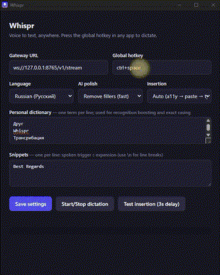

# NovaWhisper

<div align="center">

**Speak naturally. Keep your flow.**

NovaWhisper turns a global hotkey into fast, private voice-to-text: hold the shortcut, speak in any app, and receive a polished transcript exactly where your cursor is.

**English** · [Русский](README.ru.md)

</div>

> **Windows 11 only.** Run the desktop app from the repository with `cargo run -p whispr-desktop`. Running a copied standalone `.exe` is not supported unless it is packaged with the `whispr-gateway` sidecar.

## See it in action

### 1. Dictate anywhere


### 2. Speak, review, insert


### 3. Configure from the tray



## User flow: preparation → recording → recognition → result

1. **Preparation — save your settings.** Open Whispr Settings, choose the
   microphone, language, recognition provider, model, and insertion method.
   Click **Save Changes**. Wait until the gateway status is ready.
2. **Recording — start dictation.** Place the cursor where the text should
   appear, then click **Start Dictation**. Speak clearly and naturally. The
   recording HUD and Voice clipboard loader show that Whispr is listening.
3. **Recognition — stop dictation.** Click **Stop Dictation** when you finish
   speaking. Recording stops immediately, and speech recognition starts
   automatically. Keep the application running while it processes the audio.
4. **Result — use the transcript.** The recognized text is inserted at the
   cursor and added to the Voice clipboard. Review it, copy it again when
   needed, or start another dictation.

The complete sequence is: **configure and save → start and speak → stop and
recognize automatically → receive and use the text**.

NovaWhisper runs as two processes:

1. The Python/FastAPI **gateway** performs speech recognition and polishing.
2. The Rust/Tauri **desktop app** captures the microphone, displays the HUD,
   and inserts text.

You normally never manage the gateway yourself: the desktop app **starts it
automatically on launch and stops the managed process when you close Settings
or quit**. It uses the bundled
`whispr-gateway` sidecar (installer builds) or the repo's
`server/gateway/.venv` (source builds). A gateway you started manually is
detected, used as-is, and never killed. The behavior is controlled by
"Start & stop the local gateway with the app" in Settings, and gateway output
goes to `gateway.log` next to `config.json`.

## Tested environment

The current Windows/CUDA path was built and tested on:

| Component | Tested value |
|---|---|
| Operating system | Windows version 25H2, build 26200, 64-bit |
| Registry product label | Windows 10 Pro (Windows may retain this label for newer builds) |
| GPU | NVIDIA GeForce RTX 3060, 12 GB VRAM |
| NVIDIA driver | 610.74 |
| Python | 3.12 (use 3.11–3.13 — CTranslate2 wheels for the newest Python releases lag behind, so `pip install faster-whisper` can fail there) |
| Rust / Cargo | 1.97.0, MSVC toolchain |
| Local STT | faster-whisper, multilingual `large-v3` (`Systran/faster-whisper-large-v3`), CUDA `float16` |

Windows 11 is the primary supported Windows target. Linux builds are supported
with the limitations described below; macOS builds are supported on Apple
Silicon using the steps below.

## Windows installation from a clean PC

### 1. Install prerequisites

- [Git for Windows](https://git-scm.com/download/win)
- [Python 3.11–3.13](https://www.python.org/downloads/) with **Add Python to PATH**
  (3.12 recommended; the newest Python may not have CTranslate2 wheels yet)
- [Rust via rustup](https://rustup.rs/) using the default MSVC toolchain
- [Visual Studio Build Tools](https://visualstudio.microsoft.com/visual-cpp-build-tools/)
  with **Desktop development with C++**
- A current NVIDIA Game Ready or Studio Driver for CUDA transcription

Windows 11 already includes WebView2. Verify the GPU driver:

```powershell
nvidia-smi
```

### 2. Clone and prepare the gateway

```powershell
git clone https://github.com/DmitryGrigorov/NovaWhisper.git
cd NovaWhisper\server\gateway

py -m venv .venv
.\.venv\Scripts\python.exe -m pip install --upgrade pip
.\.venv\Scripts\pip.exe install -r requirements.txt
.\.venv\Scripts\pip.exe install -r requirements-local.txt
```

`requirements-local.txt` installs faster-whisper plus CUDA 12 cuBLAS and
cuDNN 9 DLLs inside the virtual environment. A separate full CUDA Toolkit is
normally unnecessary; a working NVIDIA driver is still required. The gateway
adds these package-local DLL directories automatically on Windows.

### Windows Whisper models

In **Settings → Whisper model**, Windows/CUDA users can choose:

| Model | Use case |
|---|---|
| `large` / `large-v3` | Highest-quality multilingual recognition. `large` is the faster-whisper alias for `large-v3`. |
| `large-v3-turbo` | Faster, lower-latency multilingual recognition with a small quality trade-off. |
| `medium` / `small` | Lower VRAM use; useful on less capable GPUs. |

For an NVIDIA GPU, use **CUDA** with **float16**. Selecting a model in Settings downloads it automatically the first time it starts. To download a model before launching the app, run one of these commands from `NovaWhisper\server\gateway`:

```powershell
$env:HF_HUB_DISABLE_XET = "1"

# Highest quality: `large` is an alias for `large-v3`.
.\.venv\Scripts\python.exe -c "from faster_whisper import download_model; print(download_model('large-v3'))"

# Faster large-v3 variant, recommended when low latency matters.
.\.venv\Scripts\python.exe -c "from faster_whisper import download_model; print(download_model('large-v3-turbo'))"

# Smaller models for lower VRAM use.
.\.venv\Scripts\python.exe -c "from faster_whisper import download_model; print(download_model('medium'))"
.\.venv\Scripts\python.exe -c "from faster_whisper import download_model; print(download_model('small'))"
```

Download only the model you intend to use. After it is cached, select the matching name in **Settings → Whisper model** and click **Save settings** (or **Start gateway**).

### 3. Download the multilingual model (optional)

The model downloads automatically the first time the gateway starts. If
background Hugging Face downloads stall, pre-download the default multilingual
`large-v3` model (≈3 GB):

```powershell
$env:HF_HUB_DISABLE_XET = "1"
.\.venv\Scripts\python.exe -c "from huggingface_hub import snapshot_download; print(snapshot_download('Systran/faster-whisper-large-v3'))"
```

`large-v3` supports Russian (and ~100 other languages) with the highest
Whisper quality; on an RTX-class GPU it transcribes faster than real time. On
low-VRAM or CPU-only machines, switch the model to `small` in Settings.

### 4. Build and run the desktop app

```powershell
cd NovaWhisper
cargo build --release -p whispr-desktop
.\target\release\whispr-desktop.exe
```

On launch the app **starts the gateway by itself** using
`server\gateway\.venv` from step 2 (defaults: local Whisper `large-v3`,
CUDA), and stops it again when you quit. Watch the event log at the bottom of
the Settings window: it shows `gateway: starting… / ready`. The tray menu has
**Restart Gateway**, and the gateway log lives at
`%APPDATA%\whispr\gateway.log`.

To verify from a terminal:

```powershell
Invoke-RestMethod http://127.0.0.1:8765/healthz
```

Expected result: `status : ok`.

The standalone executable is `NovaWhisper\target\release\whispr-desktop.exe`.
If you copy it outside the repository, put the `whispr-gateway` sidecar folder
next to it (see "Self-contained installers" below) — otherwise the app cannot
find a gateway to start. The development command is `cargo run -p whispr-desktop`.

### 5. Use dictation

1. In Settings, use `ws://127.0.0.1:8765/v1/stream` (default).
2. Select **Russian (Русский)**, another language, or **Auto-detect**.
3. Focus a text field and press the configured hotkey.
4. Speak, then press the hotkey again to finish and insert the text.
5. Drag the recording HUD to move it around the screen.

Configuration is stored in `%APPDATA%\whispr\config.json`. Provider, Whisper
model, device, and compute type are all in Settings — saving restarts the
managed gateway with the new values.

### Manual gateway (optional, for debugging)

The app detects an already-running gateway and leaves it alone, so you can
still run one by hand:

```powershell
cd NovaWhisper\server\gateway
$env:HF_HUB_DISABLE_XET = "1"
$env:WHISPR_STT_PROVIDER = "whisper_local"
$env:WHISPR_WHISPER_MODEL = "large-v3"
$env:WHISPR_WHISPER_DEVICE = "cuda"
$env:WHISPR_WHISPER_COMPUTE = "float16"
.\.venv\Scripts\uvicorn.exe app.main:app --host 127.0.0.1 --port 8765
```

## Self-contained installers (setup .exe / .dmg / .deb)

To ship a package that needs **no Python at all** on the target machine, the
gateway is frozen into a `whispr-gateway` sidecar (PyInstaller) and bundled
into the installer; the app starts and stops it automatically.

```sh
# 1. Build the gateway sidecar — run on the OS you are packaging for
./scripts/build-gateway.sh      # macOS / Linux
scripts\build-gateway.ps1       # Windows (includes CUDA DLLs when installed)

# 2. Build the app + installer
cargo install tauri-cli --version '^2' --locked   # once
cargo tauri build               # Windows: NSIS setup .exe · Linux: .deb + .AppImage · macOS: .dmg
```

Installers land in `target/release/bundle/`. Notes:

- The Windows CUDA sidecar bundles cuBLAS/cuDNN and is several GB; if the
  NSIS installer build fails on size, ship the portable layout instead: zip
  `whispr-desktop.exe` with the `whispr-gateway` folder side by side — the
  app also finds the sidecar next to its own executable.
- Gateway discovery order at startup: `WHISPR_GATEWAY_BIN` env override →
  `whispr-gateway` next to the app executable or in the bundle resources →
  repo `server/gateway` with its `.venv` → `python`/`python3` on PATH. If
  nothing is found, the Settings event log says so.

## CPU fallback

In Settings: Whisper device **CPU**, compute type **int8**, and model `small`
(`large-v3` is too slow on CPU). Equivalent env vars for a manual gateway:

```powershell
$env:WHISPR_STT_PROVIDER = "whisper_local"
$env:WHISPR_WHISPER_MODEL = "small"
$env:WHISPR_WHISPER_DEVICE = "cpu"
$env:WHISPR_WHISPER_COMPUTE = "int8"
```

## Linux quick setup

Install Python, Rust, WebKitGTK 4.1, GTK 3, appindicator, ALSA, OpenSSL,
`libxdo`, and `patchelf`. Then run:

```sh
cd server/gateway
python3 -m venv .venv
./.venv/bin/pip install -r requirements.txt          # mock/dev providers
./.venv/bin/pip install -r requirements-local.txt    # + local Whisper (optional)

# From the repository root — the app starts/stops the gateway itself
cargo run -p whispr-desktop
```

For a `.deb`/`.AppImage` that runs without Python, build the sidecar first
(`./scripts/build-gateway.sh`), then `cargo tauri build`.

Global hotkeys and insertion currently need X11/XWayland on Linux.

## macOS Apple Silicon (M2) — local `small` model

The following setup targets an Apple Silicon M2 Mac. The MLX backend runs
Whisper on the Apple GPU through Metal; `faster-whisper` remains available as a
CPU fallback. The multilingual `small` model is the recommended default for a
fanless MacBook Air.

Install the required tools:

```sh
xcode-select --install
brew install rust python@3.13
```

Create the gateway environment with Python 3.13. If an older `.venv` already
exists, preserve it before creating the new environment:

```sh
cd /path/to/NovaWhisper/server/gateway
mv .venv .venv-backup  # only when an old .venv already exists
/opt/homebrew/bin/python3.13 -m venv .venv
./.venv/bin/pip install --upgrade pip
./.venv/bin/pip install -r requirements.txt
./.venv/bin/pip install -r requirements-mlx.txt
```

Download the model in advance (otherwise it downloads on first gateway start):

```sh
./.venv/bin/python -c "from huggingface_hub import snapshot_download; print(snapshot_download('mlx-community/whisper-small-mlx'))"
```

Run the desktop app from the repository root:

```sh
cd /path/to/NovaWhisper
cargo run -p whispr-desktop
```

In Whispr Settings select:

- **Speech-to-text provider:** MLX Whisper (Apple Silicon GPU), or Auto
- **Whisper model:** `small`
- **Whisper device / compute type:** ignored by MLX (used by CPU/CUDA fallback)
- **Start & stop the local gateway with the app:** enabled

Click **Save settings**. The app starts the gateway from
`server/gateway/.venv`; use **Tray → Restart Gateway** after changing model
settings.

MLX runs Whisper inference on the Apple GPU through Metal while CPU cores keep
handling audio capture, networking, and text processing. To force the CPU
fallback, install `requirements-faster.txt` and select **Local Whisper**.

### macOS privacy permissions

For development runs, macOS may show `whispr-desktop`, Terminal, iTerm, or the
IDE that launched Cargo in its privacy lists.

1. Open **System Settings → Privacy & Security → Microphone**.
2. Start recording in Whispr so macOS displays the permission prompt, then
   click **Allow**. Apps cannot be added to the Microphone list manually.
3. Open **System Settings → Privacy & Security → Accessibility** and click `+`.
4. In the file picker press **Cmd+Shift+G**, enter the development executable
   path below, press Return, and add it:

   ```text
   /path/to/NovaWhisper/target/debug/whispr-desktop
   ```

5. Enable the switch for `whispr-desktop`, quit the running process, and run
   `cargo run -p whispr-desktop` again.

Paths to add with the `+` button depend on how Whispr is launched:

| Privacy list | What to add with `+` | Path to enter after **Cmd+Shift+G** |
|---|---|---|
| Accessibility — `cargo run` | Development executable | `/path/to/NovaWhisper/target/debug/whispr-desktop` |
| Accessibility — installed app | Whispr application | `/Applications/Whispr.app` |
| Input Monitoring — `cargo run` | Start with the development executable; add the launcher too if the hotkey still fails | `/path/to/NovaWhisper/target/debug/whispr-desktop` |
| Input Monitoring — Terminal launcher | Apple Terminal | `/System/Applications/Utilities/Terminal.app` |
| Input Monitoring — installed app | Whispr application | `/Applications/Whispr.app` |

Replace `/path/to/NovaWhisper` with the repository's real location. For this
checkout, for example, the development executable is:

```text
/Users/dmitry/works/NovaWhisper/target/debug/whispr-desktop
```

If Cargo is launched from iTerm or an IDE instead of Apple Terminal, add that
launcher application from `/Applications` when macOS attributes permission to
it. The **Microphone** privacy page is different: it has no `+` button, so start
recording and approve the macOS prompt instead.

Accessibility permission lets Whispr paste or type the transcript into the
focused application. If the global shortcut does not respond, also enable the
launcher or `whispr-desktop` under **Privacy & Security → Input Monitoring**.
Camera, Screen Recording, Full Disk Access, and Apple Speech Recognition are
not required.

If the microphone prompt was previously dismissed and does not return, reset
it and launch dictation again:

```sh
tccutil reset Microphone ai.whispr.desktop
```

### macOS build and DMG

Install the Apple Command Line Tools and Rust, then build the desktop app from
the repository root:

```sh
xcode-select --install
brew install rust
cargo install tauri-cli --version '^2' --locked
./scripts/build-gateway.sh        # embed the self-contained gateway in the DMG
cargo test --workspace
cargo tauri build --bundles dmg
```

The sidecar backend is selected by platform and can also be forced:

```sh
WHISPR_GATEWAY_BACKEND=mlx ./scripts/build-gateway.sh  # Apple Silicon GPU
WHISPR_GATEWAY_BACKEND=cpu ./scripts/build-gateway.sh  # macOS/Linux CPU
```

Windows keeps a separate CUDA build path:

```powershell
$env:WHISPR_GATEWAY_BACKEND = "cuda"  # default; NVIDIA CUDA package
scripts\build-gateway.ps1

$env:WHISPR_GATEWAY_BACKEND = "cpu"   # optional Windows CPU package
scripts\build-gateway.ps1
```

The Apple Silicon installer is created at:

```text
target/release/bundle/dmg/Whispr_0.1.0_aarch64.dmg
```

The app is not code-signed or notarized yet. On first launch, macOS may require
you to approve it in **System Settings → Privacy & Security**. Dictation also
needs **Microphone** and **Accessibility** permission. The bundled gateway
starts and stops with the app; when developing from source you can skip
`build-gateway.sh` and the app will use `server/gateway/.venv` instead.

## Verification

```powershell
cargo test --workspace
cd server\gateway
.\.venv\Scripts\python.exe -m pytest
```

## Troubleshooting

| Symptom | Fix |
|---|---|
| Gateway does not auto-start | Read the `gateway:` lines in the Settings event log and `gateway.log` next to `config.json` (`%APPDATA%\whispr\` on Windows). Ensure `server\gateway\.venv` exists or the `whispr-gateway` sidecar sits next to the app. |
| HUD cannot connect | Tray → **Restart Gateway**; verify port 8765 and the configured WebSocket URL, then check `gateway.log`. |
| The same canned sentence is inserted | The gateway is using `mock`; pick **Local Whisper** as the provider in Settings (or `WHISPR_STT_PROVIDER=whisper_local` for a manual gateway) and make sure `requirements-local.txt` is installed. |
| First start takes minutes | The `large-v3` model (≈3 GB) is downloading; watch `gateway.log`. Pre-download it (step 3) or pick a smaller model in Settings. |
| `cublas64_12.dll` or `cudnn64_9.dll` is missing | Re-run `pip install -r requirements-local.txt`, then restart the gateway. |
| CUDA still fails | Check `nvidia-smi`, update the NVIDIA driver, or use the CPU fallback. |
| `link.exe` is missing | Install Visual Studio Build Tools with Desktop development with C++. |
| Microphone is unavailable | Select a Windows default input device and close apps using it exclusively. |
| Hotkey is rejected | Use a combination such as `ctrl+shift+space` or `alt+d`. |

## Repository map

| Path | Purpose |
|---|---|
| `core/` | Rust audio, protocol, VAD, configuration, and streaming client |
| `platform/insert/` | Cross-application text insertion |
| `apps/desktop/` | Tauri desktop app and UI |
| `server/gateway/` | FastAPI gateway, STT providers, and transcript polish |
| `scripts/` | `build-gateway.sh` / `.ps1` — self-contained gateway sidecar builds |
| `shared/protocol.md` | Client/gateway wire protocol |
| `docs/` | Architecture, structure, and development recipes |

See [Architecture](docs/ARCHITECTURE.md), [Project structure](docs/STRUCTURE.md),
and [development recipes](docs/SKILLS.md).
