# NovaWhisper

<div align="center">

**Говорите естественно. Не теряйте поток мысли.**

NovaWhisper превращает глобальную горячую клавишу в быстрый и приватный голосовой ввод для Windows/MacOS/Linux (Ubuntu): зажмите сочетание, говорите в любом приложении — и вставляйте обработанный текст точно в позицию курсора.

[English](README.md) · **Русский**

</div>

> **Windows 11 и MacOS** Запускайте приложение из репозитория командой `cargo run -p whispr-desktop`. Запуск скопированного отдельного `.exe` не поддерживается, если рядом с ним нет sidecar `whispr-gateway`.

## Посмотрите, как это работает

Визуальный обзор рабочего процесса.


### 1. Whispr готов к работе

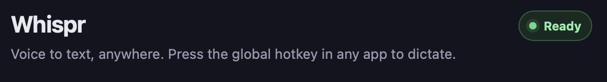

### 2. Настройте горячую клавишу и микрофон

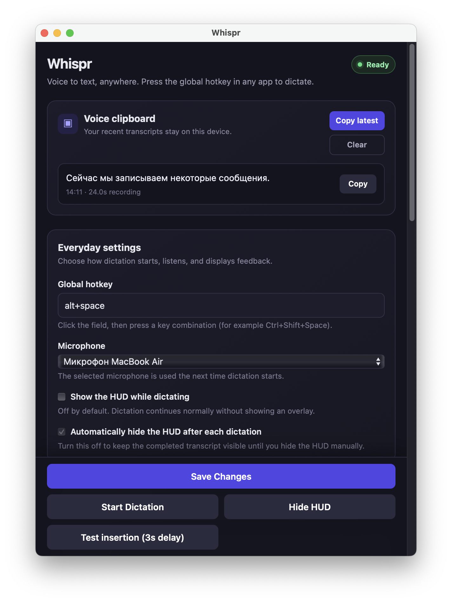

### 3. Выберите язык, модель и способ вставки

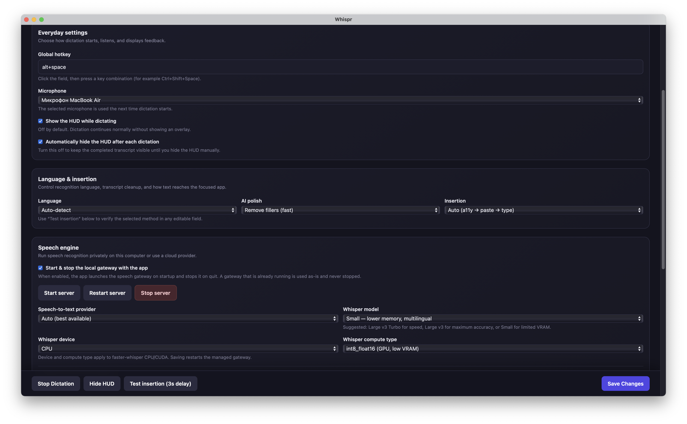

### 4. Сохраните и дождитесь готовности модели

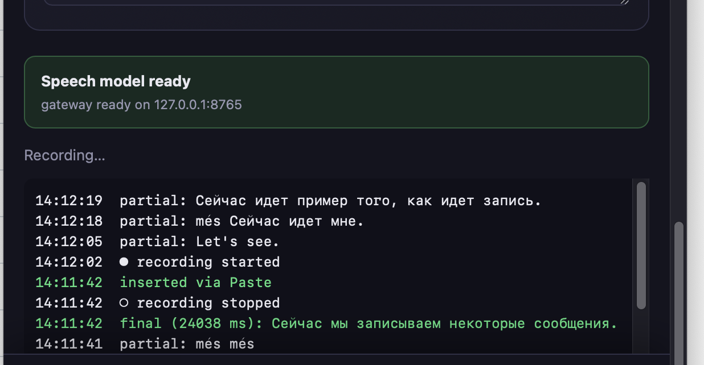

### 5. Запустите диктовку

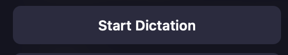

### 6. Говорите — Whispr слушает

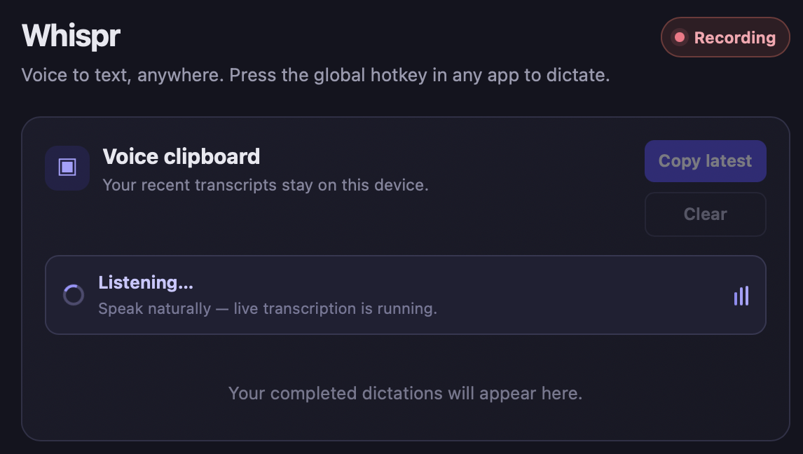

### 7. Управляйте записью через HUD

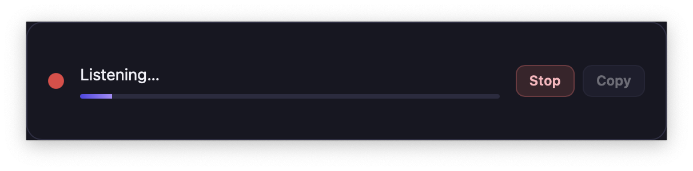

### 8. Остановитесь и дождитесь распознавания

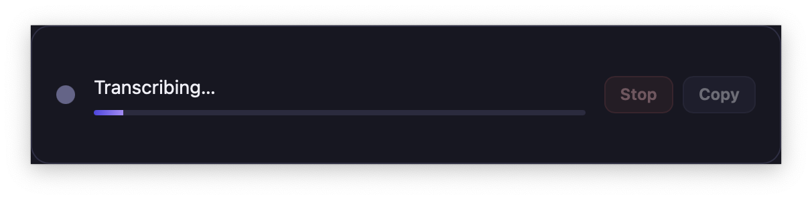

### 9. Расшифровки сохраняются в Voice clipboard

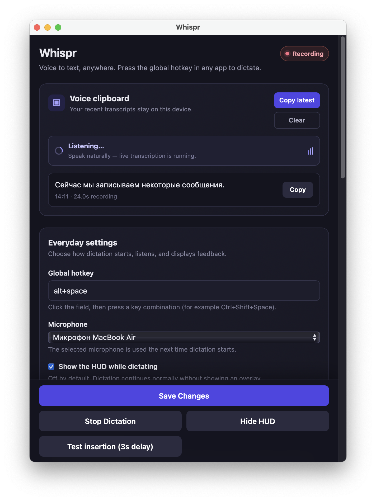

### 10. Всё управление в одном окне

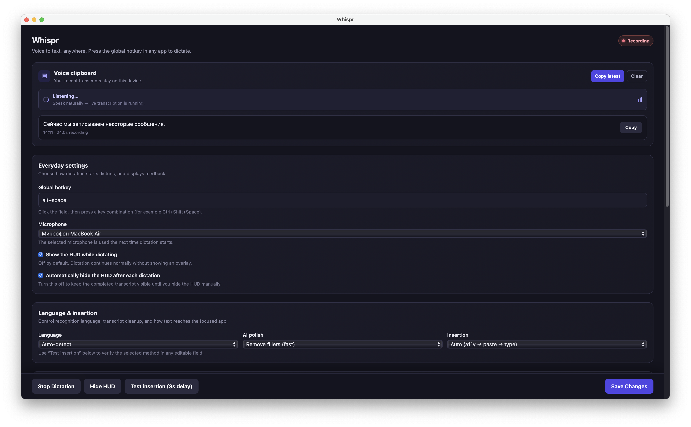

### 11. Tray

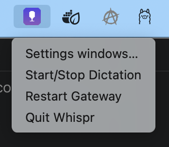

## Пользовательский сценарий: подготовка → запись → распознавание → результат

1. **Подготовка — сохраните настройки.** Откройте Settings приложения Whispr,
   выберите микрофон, язык, провайдер распознавания, модель и способ вставки.
   Нажмите **Save Changes**. Дождитесь готовности gateway.
2. **Запись — запустите диктовку.** Установите курсор туда, где должен появиться
   текст, затем нажмите **Start Dictation**. Говорите ясно и естественно. HUD
   записи и индикатор Voice clipboard показывают, что Whispr слушает.
3. **Распознавание — остановите диктовку.** Закончив говорить, нажмите
   **Stop Dictation**. Запись сразу остановится, а распознавание речи запустится
   автоматически. Не закрывайте приложение, пока оно обрабатывает аудио.
4. **Результат — используйте текст.** Распознанный текст появится в позиции
   курсора и сохранится в Voice clipboard. Проверьте его, скопируйте повторно
   при необходимости либо начните новую диктовку.

Полная последовательность: **настроить и сохранить → запустить и произнести →
остановить и автоматически распознать → получить и использовать текст**.

NovaWhisper состоит из двух процессов:

1. Python/FastAPI **gateway** распознаёт и обрабатывает речь.
2. Rust/Tauri **desktop-приложение** записывает микрофон, показывает HUD и
   вставляет текст.

Управлять gateway вручную обычно не нужно: приложение **запускает его
автоматически при старте и останавливает управляемый процесс при закрытии
Settings или выходе**. Используется либо
встроенный sidecar `whispr-gateway` (сборки-установщики), либо
`server/gateway/.venv` из репозитория (сборка из исходников). Уже запущенный
вручную gateway приложение обнаруживает, использует и никогда не убивает.
Поведение включается настройкой «Start & stop the local gateway with the app»,
вывод gateway пишется в `gateway.log` рядом с `config.json`.

## Проверенное оборудование и система

Текущий Windows/CUDA-вариант собран и проверен на следующей конфигурации:

| Компонент | Проверенное значение |
|---|---|
| Операционная система | Windows, версия 25H2, сборка 26200, 64-bit |
| Название в реестре | Windows 10 Pro (Windows может сохранять старое название для новых сборок) |
| Видеокарта | NVIDIA GeForce RTX 3060, 12 ГБ VRAM |
| Драйвер NVIDIA | 610.74 |
| Python | 3.12 (используйте 3.11–3.13 — для самых новых версий Python колёса CTranslate2 выходят с задержкой, и `pip install faster-whisper` может не сработать) |
| Rust / Cargo | 1.97.0, toolchain MSVC |
| Локальное распознавание | faster-whisper, мультиязычная `large-v3` (`Systran/faster-whisper-large-v3`), CUDA `float16` |

Основная поддерживаемая Windows-цель — Windows 11. Linux собирается с
ограничениями, указанными ниже; macOS собирается, но пока не тестировалась.

## Установка на чистый Windows-ПК

### 1. Установите необходимые программы

- [Git for Windows](https://git-scm.com/download/win)
- [Python 3.11–3.13](https://www.python.org/downloads/) с опцией **Add Python to PATH**
  (рекомендуется 3.12; для самого нового Python может не быть колёс CTranslate2)
- [Rust через rustup](https://rustup.rs/) со стандартным MSVC toolchain
- [Visual Studio Build Tools](https://visualstudio.microsoft.com/visual-cpp-build-tools/)
  с workload **Desktop development with C++**
- Свежий NVIDIA Game Ready или Studio Driver для распознавания на CUDA

WebView2 уже входит в Windows 11. Проверьте NVIDIA-драйвер:

```powershell
nvidia-smi
```

### 2. Клонируйте проект и подготовьте gateway

```powershell
git clone https://github.com/DmitryGrigorov/NovaWhisper.git
cd NovaWhisper\server\gateway

py -m venv .venv
.\.venv\Scripts\python.exe -m pip install --upgrade pip
.\.venv\Scripts\pip.exe install -r requirements.txt
.\.venv\Scripts\pip.exe install -r requirements-local.txt
```

`requirements-local.txt` устанавливает faster-whisper, CUDA 12 cuBLAS и
cuDNN 9 DLL внутрь виртуального окружения. Полный CUDA Toolkit обычно не
нужен — достаточно рабочего NVIDIA-драйвера. Gateway автоматически добавляет
каталоги этих DLL на Windows.

### 3. Загрузите мультиязычную модель (необязательно)

При первом запуске gateway модель скачивается автоматически. Если фоновая
загрузка Hugging Face зависает, заранее скачайте мультиязычную `large-v3`
(≈3 ГБ), используемую по умолчанию:

```powershell
$env:HF_HUB_DISABLE_XET = "1"
.\.venv\Scripts\python.exe -c "from huggingface_hub import snapshot_download; print(snapshot_download('Systran/faster-whisper-large-v3'))"
```

`large-v3` поддерживает русский (и ещё ~100 языков) с максимальным качеством
Whisper; на GPU уровня RTX распознаёт быстрее реального времени. На машинах с
малым объёмом VRAM или без GPU выберите в Settings модель `small`.

### 4. Соберите и запустите приложение

```powershell
cd NovaWhisper
cargo build --release -p whispr-desktop
.\target\release\whispr-desktop.exe
```

При запуске приложение **само стартует gateway** из `server\gateway\.venv`
(по умолчанию: локальный Whisper `large-v3`, CUDA) и останавливает его при
выходе. Журнал событий внизу окна Settings показывает `gateway: starting… /
ready`. В меню трея есть **Restart Gateway**; лог gateway лежит в
`%APPDATA%\whispr\gateway.log`.

Проверка из терминала:

```powershell
Invoke-RestMethod http://127.0.0.1:8765/healthz
```

Ожидаемый ответ: `status : ok`.

Standalone-файл — `NovaWhisper\target\release\whispr-desktop.exe`. Если вы
копируете его за пределы репозитория, положите рядом папку sidecar
`whispr-gateway` (см. «Автономные установщики» ниже) — иначе приложению нечего
запускать. Команда для разработки: `cargo run -p whispr-desktop`.

### 5. Настройте голосовой ввод

1. В Settings укажите `ws://127.0.0.1:8765/v1/stream` (по умолчанию).
2. Выберите **Russian (Русский)** либо **Auto-detect**.
3. Поставьте курсор в текстовое поле и нажмите настроенную горячую клавишу.
4. Произнесите текст и снова нажмите горячую клавишу для завершения и вставки.
5. Индикатор записи можно перемещать по экрану мышью.

Настройки находятся в `%APPDATA%\whispr\config.json`. Провайдер, модель
Whisper, устройство и тип вычислений задаются в Settings — после сохранения
управляемый gateway перезапускается с новыми значениями.

### Ручной запуск gateway (необязательно, для отладки)

Уже запущенный gateway приложение обнаруживает и не трогает, поэтому его
по-прежнему можно запустить вручную:

```powershell
cd NovaWhisper\server\gateway
$env:HF_HUB_DISABLE_XET = "1"
$env:WHISPR_STT_PROVIDER = "whisper_local"
$env:WHISPR_WHISPER_MODEL = "large-v3"
$env:WHISPR_WHISPER_DEVICE = "cuda"
$env:WHISPR_WHISPER_COMPUTE = "float16"
.\.venv\Scripts\uvicorn.exe app.main:app --host 127.0.0.1 --port 8765
```

## Автономные установщики (setup .exe / .dmg / .deb)

Чтобы собрать пакет, которому **не нужен Python** на целевой машине, gateway
замораживается в sidecar `whispr-gateway` (PyInstaller) и попадает внутрь
установщика; приложение запускает и останавливает его автоматически.

```sh
# 1. Соберите sidecar — на той ОС, для которой собираете пакет
./scripts/build-gateway.sh      # macOS / Linux
scripts\build-gateway.ps1       # Windows (CUDA DLL включаются автоматически)

# 2. Соберите приложение и установщик
cargo install tauri-cli --version '^2' --locked   # один раз
cargo tauri build               # Windows: NSIS setup .exe · Linux: .deb + .AppImage · macOS: .dmg
```

Установщики появляются в `target/release/bundle/`. Замечания:

- Windows-sidecar с CUDA включает cuBLAS/cuDNN и занимает несколько ГБ; если
  сборка NSIS-установщика падает из-за размера, используйте портативный
  вариант: положите `whispr-desktop.exe` и папку `whispr-gateway` рядом в один
  каталог — приложение находит sidecar рядом со своим exe.
- Порядок поиска gateway при старте: переменная `WHISPR_GATEWAY_BIN` →
  `whispr-gateway` рядом с exe или в ресурсах пакета → `server/gateway` с
  `.venv` из репозитория → `python`/`python3` из PATH. Если ничего не найдено,
  журнал событий в Settings сообщит об этом.

## Запуск на CPU без NVIDIA

В Settings: устройство Whisper — **CPU**, тип вычислений — **int8**, модель —
`small` (`large-v3` на CPU слишком медленная). Эквивалентные переменные для
ручного запуска:

```powershell
$env:WHISPR_STT_PROVIDER = "whisper_local"
$env:WHISPR_WHISPER_MODEL = "small"
$env:WHISPR_WHISPER_DEVICE = "cpu"
$env:WHISPR_WHISPER_COMPUTE = "int8"
```

## Быстрая установка на Linux

Установите Python, Rust, WebKitGTK 4.1, GTK 3, appindicator, ALSA, OpenSSL,
`libxdo` и `patchelf`. Затем выполните:

```sh
cd server/gateway
python3 -m venv .venv
./.venv/bin/pip install -r requirements.txt          # mock/dev-провайдеры
./.venv/bin/pip install -r requirements-local.txt    # + локальный Whisper (опционально)

# Из корня репозитория — gateway запустится и остановится автоматически
cargo run -p whispr-desktop
```

Для `.deb`/`.AppImage` без Python на целевой машине сначала соберите sidecar
(`./scripts/build-gateway.sh`), затем `cargo tauri build`.

Глобальная горячая клавиша и вставка текста на Linux сейчас требуют
X11/XWayland.

## macOS Apple Silicon (M2) — локальная модель `small`

Эта конфигурация предназначена для Mac с Apple Silicon M2. Backend MLX запускает
Whisper на GPU Apple через Metal; `faster-whisper` остаётся доступен как CPU
fallback. Для MacBook Air без вентилятора рекомендуется многоязычная модель
`small`.

Установите необходимые инструменты:

```sh
xcode-select --install
brew install rust python@3.13
```

Создайте окружение gateway на Python 3.13. Если старое окружение `.venv` уже
существует, сохраните его перед созданием нового:

```sh
cd /path/to/NovaWhisper/server/gateway
mv .venv .venv-backup  # только если старое окружение .venv уже существует
/opt/homebrew/bin/python3.13 -m venv .venv
./.venv/bin/pip install --upgrade pip
./.venv/bin/pip install -r requirements.txt
./.venv/bin/pip install -r requirements-mlx.txt
```

Заранее скачайте модель (иначе она скачается при первом запуске gateway):

```sh
./.venv/bin/python -c "from huggingface_hub import snapshot_download; print(snapshot_download('mlx-community/whisper-small-mlx'))"
```

Запустите desktop-приложение из корня репозитория:

```sh
cd /path/to/NovaWhisper
cargo run -p whispr-desktop
```

В Settings приложения Whispr выберите:

- **Speech-to-text provider:** MLX Whisper (Apple Silicon GPU) либо Auto
- **Whisper model:** `small`
- **Whisper device / compute type:** игнорируются MLX и нужны CPU/CUDA fallback
- **Start & stop the local gateway with the app:** включено

Нажмите **Save settings**. Приложение запускает gateway из
`server/gateway/.venv`. После изменения модели используйте
**Tray → Restart Gateway**.

MLX выполняет Whisper-инференс на GPU Apple через Metal, а ядра CPU продолжают
обрабатывать захват аудио, сеть и текст. Чтобы принудительно использовать CPU,
установите `requirements-faster.txt` и выберите **Local Whisper**.

### Разрешения конфиденциальности macOS

При запуске версии для разработки macOS может показывать в списках разрешений
`whispr-desktop`, Terminal, iTerm либо IDE, из которой был запущен Cargo.

1. Откройте **System Settings → Privacy & Security → Microphone**.
2. Начните запись в Whispr, дождитесь системного запроса и нажмите **Allow**.
   Добавить приложение в список Microphone вручную нельзя.
3. Откройте **System Settings → Privacy & Security → Accessibility** и
   нажмите `+`.
4. В окне выбора файла нажмите **Cmd+Shift+G**, введите путь к исполняемому
   файлу версии для разработки, нажмите Return и добавьте файл:

   ```text
   /path/to/NovaWhisper/target/debug/whispr-desktop
   ```

5. Включите переключатель для `whispr-desktop`, завершите работающий процесс и
   снова выполните `cargo run -p whispr-desktop`.

Путь для кнопки `+` зависит от способа запуска Whispr:

| Список разрешений | Что добавить через `+` | Путь после нажатия **Cmd+Shift+G** |
|---|---|---|
| Accessibility — `cargo run` | Исполняемый файл версии для разработки | `/path/to/NovaWhisper/target/debug/whispr-desktop` |
| Accessibility — установленное приложение | Приложение Whispr | `/Applications/Whispr.app` |
| Input Monitoring — `cargo run` | Сначала исполняемый файл; если hotkey не работает, добавьте также программу запуска | `/path/to/NovaWhisper/target/debug/whispr-desktop` |
| Input Monitoring — запуск из Terminal | Apple Terminal | `/System/Applications/Utilities/Terminal.app` |
| Input Monitoring — установленное приложение | Приложение Whispr | `/Applications/Whispr.app` |

Замените `/path/to/NovaWhisper` реальным расположением репозитория. Например,
для этого рабочего каталога путь к исполняемому файлу выглядит так:

```text
/Users/dmitry/works/NovaWhisper/target/debug/whispr-desktop
```

Если Cargo запускается из iTerm или IDE, а не из Apple Terminal, добавьте через
`+` соответствующее приложение из `/Applications`, если macOS связывает
разрешение именно с ним. В разделе **Microphone** кнопки `+` нет: начните запись
и подтвердите системный запрос.

Разрешение Accessibility позволяет Whispr вставлять или печатать расшифровку в
активном приложении. Если глобальная горячая клавиша не срабатывает, включите
программу запуска или `whispr-desktop` также в разделе
**Privacy & Security → Input Monitoring**. Разрешения Camera, Screen Recording,
Full Disk Access и Apple Speech Recognition не требуются.

Если запрос доступа к микрофону был отклонён и больше не появляется, сбросьте
разрешение и снова запустите диктовку:

```sh
tccutil reset Microphone ai.whispr.desktop
```

### Сборка macOS и DMG

Установите Apple Command Line Tools и Rust, затем выполните сборку из корня
репозитория:

```sh
xcode-select --install
brew install rust
cargo install tauri-cli --version '^2' --locked
./scripts/build-gateway.sh        # встроить автономный gateway в DMG
cargo test --workspace
cargo tauri build --bundles dmg
```

Backend sidecar выбирается по платформе автоматически, но его можно указать:

```sh
WHISPR_GATEWAY_BACKEND=mlx ./scripts/build-gateway.sh  # GPU Apple Silicon
WHISPR_GATEWAY_BACKEND=cpu ./scripts/build-gateway.sh  # CPU macOS/Linux
```

Для Windows остаётся отдельная CUDA-сборка:

```powershell
$env:WHISPR_GATEWAY_BACKEND = "cuda"  # по умолчанию; NVIDIA CUDA
scripts\build-gateway.ps1

$env:WHISPR_GATEWAY_BACKEND = "cpu"   # опциональная Windows CPU-сборка
scripts\build-gateway.ps1
```

Установщик для Apple Silicon будет создан здесь:

```text
target/release/bundle/dmg/Whispr_0.1.0_aarch64.dmg
```

Приложение пока не подписано и не нотаризовано. При первом запуске macOS может
потребовать разрешить его в **System Settings → Privacy & Security**. Для
диктовки также нужны разрешения **Microphone** и **Accessibility**. Встроенный
gateway запускается и останавливается вместе с приложением. При разработке из
исходников можно не выполнять `build-gateway.sh`: приложение использует
`server/gateway/.venv`.

## Проверка проекта

```powershell
cargo test --workspace
cd server\gateway
.\.venv\Scripts\python.exe -m pytest
```

## Решение проблем

| Симптом | Решение |
|---|---|
| Gateway не стартует автоматически | Посмотрите строки `gateway:` в журнале событий Settings и файл `gateway.log` рядом с `config.json` (`%APPDATA%\whispr\`). Убедитесь, что есть `server\gateway\.venv` либо папка sidecar `whispr-gateway` рядом с приложением. |
| HUD не подключается | Трей → **Restart Gateway**; проверьте порт 8765 и WebSocket URL в Settings, затем `gateway.log`. |
| Всегда вставляется одинаковая фраза | Работает `mock`; выберите провайдер **Local Whisper** в Settings (или `WHISPR_STT_PROVIDER=whisper_local` при ручном запуске) и установите `requirements-local.txt`. |
| Первый запуск длится минуты | Скачивается модель `large-v3` (≈3 ГБ); смотрите `gateway.log`. Скачайте её заранее (шаг 3) или выберите модель меньше в Settings. |
| Не найдена `cublas64_12.dll` или `cudnn64_9.dll` | Повторите `pip install -r requirements-local.txt` и перезапустите gateway. |
| CUDA по-прежнему не работает | Проверьте `nvidia-smi`, обновите драйвер либо используйте CPU-режим. |
| Не найден `link.exe` | Установите Visual Studio Build Tools с Desktop development with C++. |
| Недоступен микрофон | Выберите устройство ввода Windows по умолчанию и закройте приложения с монопольным доступом. |
| Не принимается hotkey | Используйте комбинацию вида `ctrl+shift+space` или `alt+d`. |

## Структура репозитория

| Путь | Назначение |
|---|---|
| `core/` | Аудио, протокол, VAD, конфигурация и streaming client на Rust |
| `platform/insert/` | Вставка текста в другие приложения |
| `apps/desktop/` | Tauri desktop-приложение и интерфейс |
| `server/gateway/` | FastAPI gateway, STT-провайдеры и обработка текста |
| `scripts/` | `build-gateway.sh` / `.ps1` — сборка автономного sidecar gateway |
| `shared/protocol.md` | Протокол между клиентом и gateway |
| `docs/` | Архитектура, структура и инструкции разработчика |

Дополнительные документы: [архитектура](docs/ARCHITECTURE.md),
[структура проекта](docs/STRUCTURE.md) и
[инструкции разработчика](docs/SKILLS.md).
